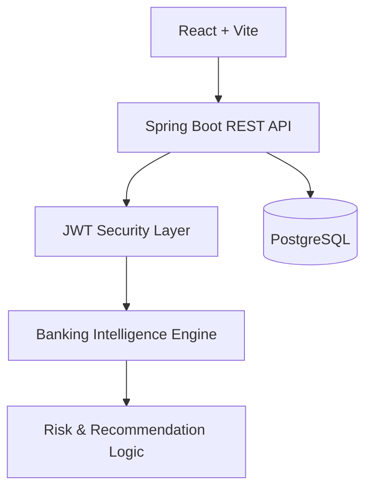
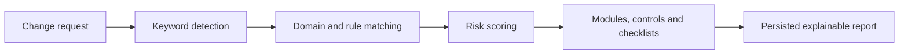

# AUREX Architecture

AUREX is an offline enterprise banking intelligence platform. It uses a deterministic Java rule engine; no cloud LLM or external AI API is required.

The backend follows controller → service → repository → entity layers. Analysis results are persisted as a user-owned change request, including the structured report payload.

## Analysis pipeline

