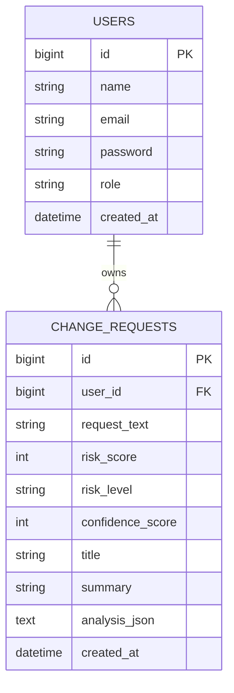

# Database Schema

PostgreSQL is managed through Flyway migrations. Hibernate starts in `validate`
mode, so it can never alter production tables implicitly.



Analysis ownership is enforced through the authenticated user identity when history or individual reports are retrieved.

## Local bootstrap

The repository includes PostgreSQL 17 under `database/`, configured for port
`5433`. Start it and provision the least-privileged application role once:

```powershell
cd database
.\bootstrap-aurex.ps1 -StartServer -AdminPassword (Read-Host -AsSecureString) -ApplicationPassword (Read-Host -AsSecureString)
```

Then place that application password in `aurex-backend/.env.example` (or, for
deployment, supply the equivalent `DB_*` environment variables). On the first
backend start Flyway creates the tables and records the applied migration in
`flyway_schema_history`. Do not use `ddl-auto=update` or edit the generated
tables manually; add a new `V<version>__description.sql` migration instead.
